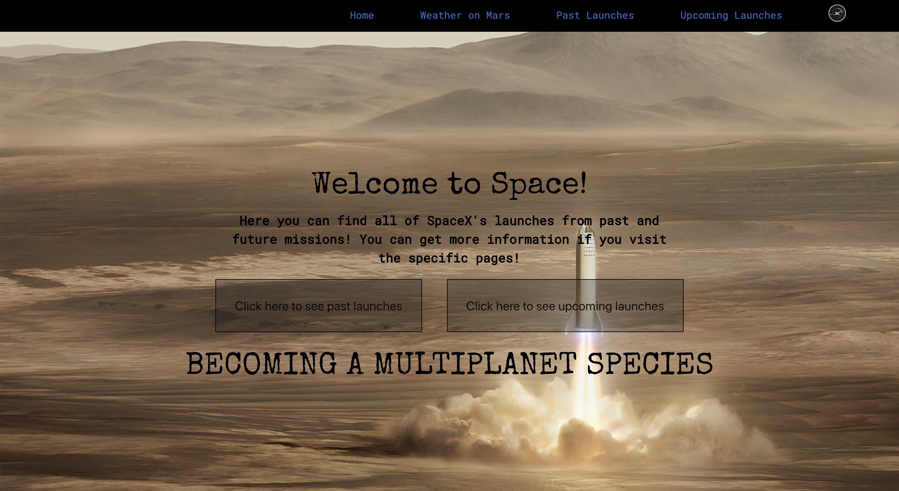
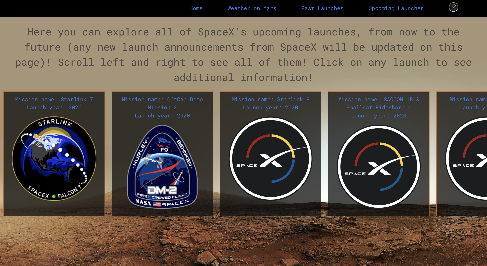

###  General Assembly, Software Engineering Immersive
# SPACE X 

## Overview


This is my second project of the software engineering immersive course at GA London. The assignment was to build a React application that consumes a public API. The project was to be completed in teams of 2 within 48 hours.

Making use of the Space-X public API, we built a website that allows the user to see all the past launches that Space-X has been done, as well to see all the upcoming launches to be done. 
As the API is being updated when a launch is done, the webpage will be automatically render the flights from upcoming to past flights.


You can launch the site on GitHub pages [here](https://dromerosalem.github.io/project-2/) 

## The Brief 

- **Consume a public API**  – this could be anything but it must make sense for your project.
- **Have several components** - At least one classical and one functional.
- **The app should include a router**  - with several "pages".
- **Be deployed online and accessible to the public.** 


## The Technologies used 

- JavaScript (ES6)
- React.js
- HTML, JSX
- Space-X public API
- HTML, JSX
- Webpack
- NPM
- Git and GitHub
- Google Fonts


## The Approach 

As a pair we were both interested in Space-X  and their missions to Mars. So we've decided to make a flight tracker what will show us the upcoming flights and the past flights in order to keep a track of the flights. 

We deceided to use a Open Source REST  [API](https://docs.spacexdata.com/?version=latest#5fc4c846-c373-43df-a10a-e9faf80a8b0a)  from Space-X that will include images and all the related information to those flights. So you could get a description of each particular mission.


**The Routes with React Router**

So we decided to have 4 main components each one with their own Route.
- `/` - as the Home page, so the landing page.
- `/past` - as the past flights rendered.
- `/upcoming` - as the upcoming flights to be done.
- `/:flightNumber` - a dinamic route that will render an idividual flight with      their description  

Later as an aditional route I add a new path `/WeatherMars` what is using just a inframe tag provided by NASA that is deploying weather measurements (temperature, wind, pressure) on the surface of Mars.


```js
const App = () => (
  <BrowserRouter basename="/project-2">
    <NavBar />
    <Switch>
      <Route exact path='/WeatherMars' component={WeatherMars}/>
      <Route exact path="/past" component={PastLaunches} />
      <Route exact path="/upcoming" component={UpcomingLaunches} />
      <Route exact path="/" component={Home} />
      <Route path="/:flightNumber" component={SingleLaunch} />
    </Switch>
  </BrowserRouter>
)

```

- **HOME**

The landing page is no more rendering two buttons that will take you rahter to the `/past` path or `/upcoming` path.

```js
        <Link to={'/past'} style={{ fontFamily: 'Special Elite', color: 'black' }}><button>Click here to see past launches</button></Link>
        
        <Link to={'/upcoming'} style={{ fontFamily: 'Special Elite', color: 'black' }}><button>Click here to see upcoming launches</button></Link>

```

 

- **Past Flights**

By using axios what was previously installed and importing the method in order to use a get request into a componentDidMount function we manage to get all the past flights.

The state will be updated as per this request.


```js
class PastLaunches extends React.Component {

  constructor() {
    super()
    this.state = {
      pastLaunchesArray: []
    }
  }

  componentDidMount() {
    axios.get('https://api.spacexdata.com/v3/launches/past')
      .then(res => this.setState({ pastLaunchesArray: res.data }))
  }
```


Rendering the information is done by maping trough the given state after geting the information from the API, by maping we have access to :
- `e.flight_number` - Flight Number
- `e.mission_name` - Mission Name
- `e.launch_year` - Flight date
- `e.links.mission_patch_small` - The patch image for each flight 

All this obtained information is returned in the form of a card that with the help of SASS we are able to go trough all the missions by scrolling left and right.

```js
render() {
    const launchCard = this.state.pastLaunchesArray.map((e, i) => (
      <div className="each-card-past" key={i}>
        <Link to={`/${e.flight_number}`}>
          <h2>Mission name: {e.mission_name}</h2>
          <h2>Launch year: {e.launch_year}</h2>
          
        </Link>
      </div>
    ))
    return <>
      <div className="past-background">
        <p className="past-introduction">
          Here you can explore all of SpaceX's past launches, from 2006 to the present! Scroll left and right to see all of them! Click on any launch to see additional information!
        </p>
        <div className="past-body">
          {launchCard}
        </div>
      </div>
    </>
  }
}
```

 


 - **Upcoming Flights**

The upcoming flights were done in a simillar manner than the past flights by using a axios method  but this time the get request is done to a different api url with our componentDidMount function.

```js
 componentDidMount() {
    axios.get('https://api.spacexdata.com/v3/launches/upcoming')
      .then(res => this.setState({ upcomingLaunchesArray: res.data }))
  }
```


Rendering and returning the elements were done in the same way as our past flights, with the only difference that most of the upcoming launches did not have a image patch to render, were we face the problem that our card were missing an image.

The solution to it is adding an image ourselfs each time that the API does not contain one, so we decided to render a Space-X logo instead.


```js
  

```




 - **Single Flights**
 In order to build an interactive single flight path so that we we click in a card this particular flight will be rendered we used the `flightNumber` as is a unique identifier for the flights 

 ```js

     const flightNumber = this.props.match.params.flightNumber

 ```

 So we will be calling in our axios get request by this indentifier 

 ```js

   componentDidMount() {
    const flightNumber = this.props.match.params.flightNumber
    axios.get(`https://api.spacexdata.com/v3/launches/${flightNumber}`)
      .then(res => this.setState({ launch: res.data }))
  }

 ```
This time the state will contain more than one property, this is due to the API structure as in order to get the additional information we had to map trough some arrays what where contained by objects. So a regular map would not work.


```js
 constructor() {
    super()
    this.state = {
      launch: {

        rocket: {
          second_stage: {
            payloads: []
          }
        },
        launch_site: {},
        links: {}
      }
    }
  }
```

Aditional 3 pictures were added in the single card. The rocket pictures, they were not included in the API so as a different mission will have a different rocket, we manage to match the `rocket_name` from the API with our stored pictures.


```js
            

```


## Potential future features

- A search field is a potential future for this project as we might want to see stright away one particular flight information.
- Instead of using a inframe tag for the wether on Mars what is making it look much more advanced will be suitable to use the NASA API with the same information in order to customize it as prefered.


## Challenges 

-Depending on the structure of the API, it can be quite tedious to get all the information that you want. So understading the API at first place was a challenge as we were not rendering what we wanted from the really begining, a lesson learned from this project will be definetly reasearch the API we want to use first.
